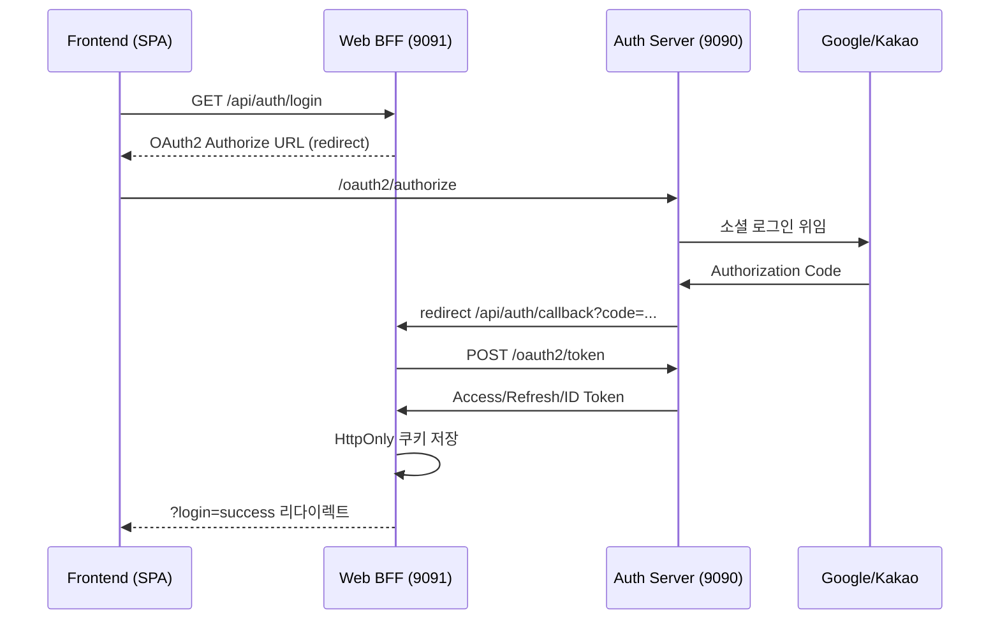
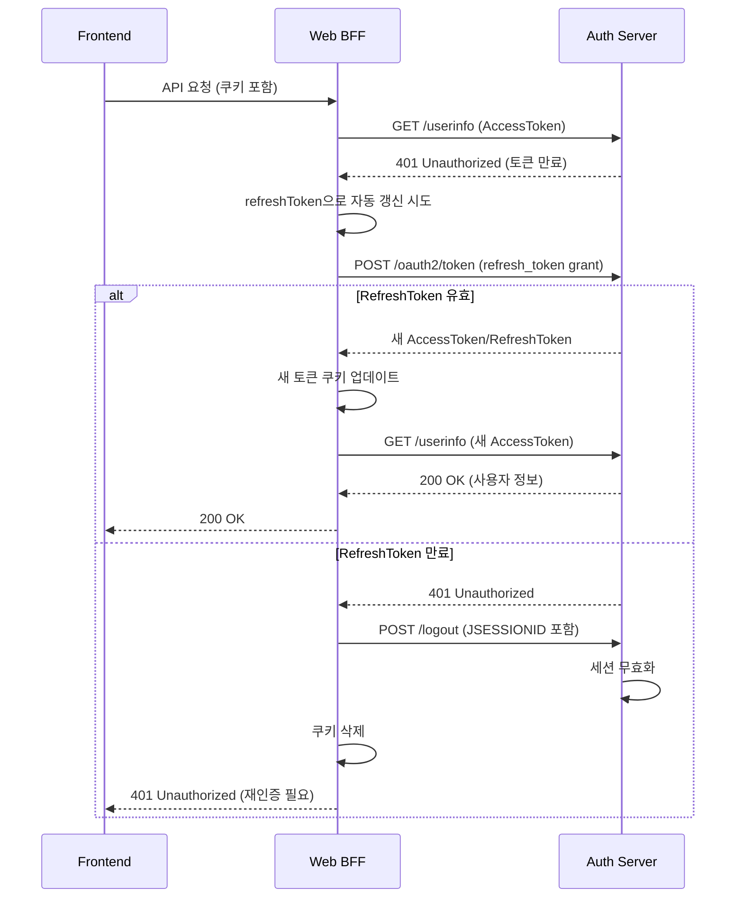
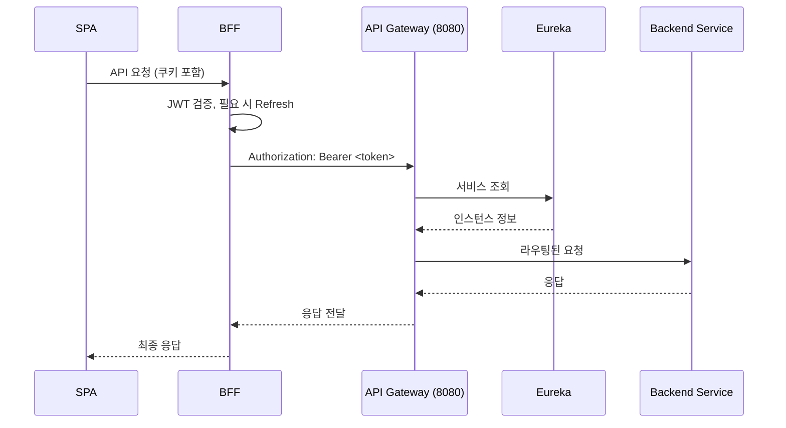

# Spring MSA Boilerplate

> Spring Boot 3.3 + Spring Cloud 2023 기반의 OAuth2/OIDC 인증 서버, BFF(Backend for Frontend), API Gateway, 서비스 디스커버리, 공통 인프라 라이브러리를 한 번에 제공하는 마이크로서비스 스타터 키트입니다.

## 📋 프로젝트 한눈에

- ✅ **OAuth2 Authorization Server** + **Web BFF** 조합으로 SPA·모바일 프런트가 토큰을 직접 다루지 않고도 로그인/로그아웃 수행
- ✅ **Spring Cloud Gateway** + **Netflix Eureka**로 서비스 라우팅·디스커버리 구성
- ✅ **Redis** (세션/Authorization Store) + **MySQL** (사용자 저장소) + **HttpOnly 쿠키** 전략으로 토큰 탈취 위험 최소화
- ✅ **commonLib**, **infra** 모듈을 통해 모든 서비스에서 동일한 상수/HTTP 상태/직렬화/암호화/웹 클라이언트 설정 재사용
- ✅ **Google/Kakao 소셜 로그인** + **자체 회원가입** (Thymeleaf) + **토큰 블랙리스트/Refresh 자동화** 기본 제공
- ✅ **자동 토큰 갱신** 및 **refreshToken 만료 시 세션 무효화** 메커니즘 내장

## 🏗️ 전체 아키텍처

```
                ┌────────────────────┐
                │   Frontend (SPA)   │ 3000
                └──────────┬─────────┘
                           │ CORS + HttpOnly 쿠키
                           ▼
┌────────────────────┐ 9091 ┌────────────────────┐ 9090 ┌────────────────────┐
│  Web BFF Server    │◄────►│  Auth Server       │◄────►│ Google / Kakao     │
│  (OAuth2 Client    │      │  (OAuth2 + OIDC)   │      │ 외부 IdP           │
│   + Resource Svr)  │      │  + Form Login      │      └────────────────────┘
└──────────┬─────────┘      └──────────┬─────────┘
           │ JWT Proxy                 │ Redis Authorization + MySQL User Store
           │                           ▼
           │                 ┌────────────────────┐ 6379
           │                 │       Redis        │
           │                 │  (Authorization    │
           │                 │   + Session)        │
           │                 └────────────────────┘
           ▼
┌────────────────────┐ 8080 ┌────────────────────┐ 8761 ┌────────────────────┐
│  API Gateway       │◄────►│  Eureka Server     │      │ Backend Services    │
│  (Spring Cloud G/W)│      │  (Discovery)        │─────►│ (주문/상품 등)      │
└────────────────────┘      └────────────────────┘      └────────────────────┘
```

## 🚀 서비스 & 포트 요약

| 모듈 | 설명 | 기본 포트 | 핵심 기술 |
| --- | --- | --- | --- |
| **authServer** | OAuth2 Authorization Server + 사용자 관리 | 9090 | Spring Authorization Server, Redis, JPA(MySQL), Thymeleaf |
| **web-bff-server** | SPA 전용 BFF (OAuth2 Client + Resource Server) | 9091 | Spring Security, WebClient, HttpOnly 쿠키, JWT 검증 |
| **apiGateway** | 외부 진입점 / 라우팅 | 8080 | Spring Cloud Gateway, Netty, Global CORS |
| **eurekaServer** | 서비스 디스커버리 | 8761 | Netflix Eureka |
| **commonLib** | 상수/에러코드/JWK 유틸 | - | Java Library, Nimbus JOSE |
| **infra** | Redis/WebClient/ObjectMapper/Encoder 등 공통 Bean | - | Java Library, @Enable* Import |

## 📦 모듈 상세

### 🔐 authServer (`authServer/`)

**핵심 구성 요소:**
- `AuthorizationServerConfig`, `SecurityConfig`: Authorization Server + Form/OAuth2 로그인 필터 체인 분리, OIDC 활성화
- `AuthorizationRepositoryConfig`: `RegisteredClient`(bff-client) 설정 및 토큰 TTL 관리 (Access 10분/Refresh 1일)
- `KeyConfig`: `commonLib`의 `Jwk.generateRsa()`로 RSA 키쌍 생성, ID Token claims 커스터마이즈
- `RedisOAuth2AuthorizationService`: **Redis 기반 Authorization 저장소**
  - `AuthCodeEntity`와 `TokenEntity` 분리 관리
  - 인덱스 기반 토큰 조회 (code → id, accessToken → id, refreshToken → id)
  - **refreshToken 만료 시간에 맞춰 메인 authorization 객체 TTL 자동 설정**
  - 토큰별 개별 TTL 관리 (accessToken, refreshToken은 각각 만료 시간에 맞춤)
- `TokenBlacklistService`: 로그아웃 시 Access Token 블랙리스트 처리
- `SignupController` + `login.html`/`signup.html`: 로컬 가입 및 소셜 2차 가입 지원
- `OAuth2LoginSuccessHandler`: 신규 소셜 사용자 → `/signup?social=true`, 기존 사용자 → 저장된 Authorization Request로 복귀
- `AppProperties`: base URL/포트 중앙 관리

### 🌐 web-bff-server (`web-bff-server/`)

**핵심 구성 요소:**
- `AuthController`: `/api/auth/login|callback|user/me|logout` REST 엔드포인트 제공
- `TokenService`: 
  - WebClient로 `/oauth2/token` 교환, `/userinfo` 조회
  - **Refresh Grant 수행 및 자동 토큰 갱신**
  - **refreshToken 만료 시 Auth Server 로그아웃 API 호출하여 세션 무효화**
  - JWT 토큰 만료 여부 확인 (30초 여유 시간)
- `UserService`: 
  - 사용자 정보 조회 (`/userinfo`)
  - **토큰 만료 시 자동 갱신 후 재시도 메커니즘**
- `CookieUtil`: Access/Refresh 토큰을 HttpOnly + SameSite=Lax 쿠키로 저장/삭제
- `JwtAuthEntryPoint`: JWT 만료 시 Refresh 성공하면 `449 Retry With` 응답으로 프런트 재시도 유도
- `SecurityConfig`: Resource Server 모드에서 Auth Server `/.well-known/jwks.json`으로 JWT 검증
- `JwtFromCookieFilter`: 쿠키에서 JWT 추출하여 Authorization 헤더 자동 주입
- `AppProperties`: Auth/BFF/Frontend URL 계산 캡슐화

### 🚪 apiGateway (`apiGateway/`)

- Spring Cloud Gateway로 `/api/auth/**` 라우팅 예제 포함
- `globalcors`에서 로컬 개발 도메인 화이트리스트 처리
- `application.yml`에 `JWT_SECRET`, `INTERNAL_TOKEN`, `permit-all-paths` 등 환경 변수 지원
- Eureka Client로 등록되어 Backend 서비스와 동적 연결

### 🔍 eurekaServer (`eurekaServer/`)

- `EurekaServerApplication` 하나로 구성
- `register-with-eureka: false` 설정으로 독립 실행
- 8761 포트에서 대시보드 제공

### 📚 commonLib (`commonLib/`)

- `ErrorCode`, `LoginResult`, `CustomHttpStatus`, `Jwk` 등 공통 상수/HTTP 상태/키 유틸 제공

### 🔧 infra (`infra/`)

- `ObjectMapperConfig` (snake_case + JavaTime)
- `RedisConfig` (GenericJackson2JsonRedisSerializer)
- `WebClientConfig`, `ModelMapperConfig`, `PasswordEncoderConfig`
- `@EnableRedisConfig`, `@EnableWebConfig`, `@EnableObjMapperConfig` 등으로 명시적 활성화

## 🔄 인증 흐름

### 로그인 플로우



### 토큰 자동 갱신 플로우



### 보호 API 호출 플로우



## 📁 디렉터리 구조

```
spring-msa-boilerplate/
├── authServer/
│   ├── config/
│   │   ├── AuthorizationServerConfig.java
│   │   ├── SecurityConfig.java
│   │   ├── KeyConfig.java
│   │   ├── AuthorizationRepositoryConfig.java
│   │   └── AppProperties.java
│   ├── controller/
│   │   ├── LoginController.java
│   │   └── SignupController.java
│   ├── handler/
│   │   ├── OAuth2LoginSuccessHandler.java
│   │   └── FormLoginSuccessHandler.java
│   ├── service/
│   │   ├── RedisOAuth2AuthorizationService.java ⭐
│   │   ├── TokenBlacklistService.java
│   │   ├── SignupService.java
│   │   └── CustomUserDetailsService.java
│   ├── entity/
│   │   ├── AuthCodeEntity.java
│   │   └── TokenEntity.java
│   └── resources/templates/
│       ├── login.html
│       └── signup.html
├── web-bff-server/
│   ├── controller/
│   │   └── AuthController.java
│   ├── service/
│   │   ├── TokenService.java ⭐
│   │   └── UserService.java ⭐
│   ├── security/
│   │   ├── JwtAuthEntryPoint.java
│   │   └── JwtFromCookieFilter.java
│   ├── utils/
│   │   └── CookieUtil.java
│   └── config/
│       ├── SecurityConfig.java
│       └── AppProperties.java
├── apiGateway/
│   └── src/main/resources/application.yml
├── eurekaServer/
├── commonLib/
├── infra/
├── docker-compose.yml (Redis)
├── build.gradle
├── settings.gradle
└── README.md
```

## 🛠️ 개발 환경 준비

### 필수 요구사항

- **Java 17 이상**
- **Redis 7.x** (또는 호환 버전) – `docker-compose up -d`
- **MySQL 8.x** (또는 호환 DB) – 사용자 정보 저장
- **Gradle Wrapper**, Git, cURL, Docker Desktop/Colima
- (선택) React/Vue 등 SPA 클라이언트 3000번 포트

### 환경 변수 설정

| 변수 | 설명 | 사용 서비스 |
| --- | --- | --- |
| `GOOGLE_CLIENT_ID`, `GOOGLE_SECRET_ID` | Google OAuth 클라이언트 정보 | authServer |
| `KAKAO_REST_API_KEY`, `KAKAO_CLIENT_SECRET` | Kakao OAuth 클라이언트 정보 | authServer |
| `TEST_DB_URL`, `DB_USERNAME`, `DB_PASSWORD` | 사용자 DB 접속 정보 | authServer |
| `JWT_SECRET` | Gateway/백엔드에서 사용하는 대칭키 | apiGateway |
| `INTERNAL_TOKEN` | 내부 호출/예시 보안 토큰 | apiGateway |

**Linux/macOS:**
```bash
export GOOGLE_CLIENT_ID=your-google-client-id
export GOOGLE_SECRET_ID=your-google-secret
export KAKAO_REST_API_KEY=your-kakao-key
export KAKAO_CLIENT_SECRET=your-kakao-secret
export TEST_DB_URL=jdbc:mysql://localhost:3306/your_db
export DB_USERNAME=your_username
export DB_PASSWORD=your_password
export JWT_SECRET=your-jwt-secret
export INTERNAL_TOKEN=your-internal-token
```

**Windows(cmd):**
```cmd
set GOOGLE_CLIENT_ID=your-google-client-id
set GOOGLE_SECRET_ID=your-google-secret
set KAKAO_REST_API_KEY=your-kakao-key
set KAKAO_CLIENT_SECRET=your-kakao-secret
set TEST_DB_URL=jdbc:mysql://localhost:3306/your_db
set DB_USERNAME=your_username
set DB_PASSWORD=your_password
set JWT_SECRET=your-jwt-secret
set INTERNAL_TOKEN=your-internal-token
```

## ▶️ 실행 방법

### 1. Redis 기동
```bash
docker-compose up -d
```

### 2. 전체 빌드
```bash
./gradlew clean build
```

### 3. 서비스 순서대로 실행
```bash
# 1. Eureka Server
./gradlew :eurekaServer:bootRun

# 2. Auth Server
./gradlew :authServer:bootRun

# 3. Web BFF Server
./gradlew :web-bff-server:bootRun

# 4. API Gateway
./gradlew :apiGateway:bootRun
```

> **Windows 사용자**: `gradlew.bat` 사용. 포트는 각 `application.yml`에서 조정 가능.

### 4. JAR 실행 (선택)
```bash
java -jar eurekaServer/build/libs/eurekaServer-0.0.1-SNAPSHOT.jar
java -jar authServer/build/libs/authServer-0.0.1-SNAPSHOT.jar
java -jar web-bff-server/build/libs/web-bff-server-0.0.1-SNAPSHOT.jar
java -jar apiGateway/build/libs/apiGateway-0.0.1-SNAPSHOT.jar
```

### 5. Health 확인
- `http://localhost:8761` (Eureka Dashboard)
- `http://localhost:9090/actuator/health` (Auth Server)
- `http://localhost:9091/actuator/health` (Web BFF)
- `http://localhost:8080/actuator/health` (API Gateway)

## 🔌 API 엔드포인트

### Web BFF Server (9091)

| 메서드 | 엔드포인트 | 설명 |
| --- | --- | --- |
| `GET` | `/api/auth/login` | 로그인 시작 (OAuth2 Authorization Server로 리다이렉트) |
| `GET` | `/api/auth/callback` | OAuth2 콜백 처리 (Authorization Code → Token 교환) |
| `GET` | `/api/auth/user/me` | 현재 사용자 정보 조회 (자동 토큰 갱신 포함) |
| `POST` | `/api/auth/logout` | 로그아웃 (토큰 쿠키 삭제 + Auth Server 세션 무효화) |

### Auth Server (9090)

| 메서드 | 엔드포인트 | 설명 |
| --- | --- | --- |
| `GET` | `/oauth2/authorize` | OAuth2 Authorization 엔드포인트 |
| `POST` | `/oauth2/token` | 토큰 발급/갱신 엔드포인트 |
| `POST` | `/oauth2/revoke` | 토큰 무효화 엔드포인트 |
| `GET` | `/userinfo` | 사용자 정보 조회 (OIDC) |
| `GET` | `/.well-known/jwks.json` | JWK Set (JWT 검증용) |
| `GET` | `/login` | 로그인 페이지 (Form/소셜 로그인) |
| `GET/POST` | `/signup` | 회원가입 페이지 |

### API Gateway (8080)

| 메서드 | 엔드포인트 | 설명 |
| --- | --- | --- |
| `GET` | `/api/auth/**` | Web BFF로 라우팅 (예시) |

### Eureka Server (8761)

| 메서드 | 엔드포인트 | 설명 |
| --- | --- | --- |
| `GET` | `/` | Eureka 대시보드 |

## 🔒 보안 & 인프라 핵심 기능

### RedisOAuth2AuthorizationService ⭐
- **Redis 기반 Authorization 저장소** 구현
- `AuthCodeEntity`와 `TokenEntity` 분리 관리
- **인덱스 기반 토큰 조회**:
  - `oauth2:code:{code}` → `authorizationId`
  - `oauth2:access_token:{token}` → `authorizationId`
  - `oauth2:refresh_token:{token}` → `authorizationId`
- **TTL 자동 관리**:
  - refreshToken 만료 시간에 맞춰 메인 authorization 객체 TTL 설정
  - accessToken/refreshToken은 각각 만료 시간에 맞춰 개별 TTL 설정
  - 수평 확장 대비 (여러 인스턴스에서 동일한 Redis 사용)

### TokenBlacklistService
- 로그아웃 시 Access Token을 남은 TTL 동안 블랙리스트로 유지
- Redis에 `oauth2:blacklist:{token}` 키로 저장

### TokenService ⭐
- **자동 토큰 갱신 메커니즘**:
  - accessToken 만료 시 refreshToken으로 자동 갱신
  - 새 토큰을 쿠키에 자동 업데이트
- **refreshToken 만료 처리**:
  - refreshToken 만료 시 Auth Server `/logout` API 호출
  - JSESSIONID 세션 무효화
  - 모든 토큰 쿠키 삭제
  - 401 응답으로 재인증 유도

### UserService ⭐
- **자동 토큰 갱신 후 재시도**:
  - `/userinfo` 호출 시 401 응답 감지
  - 자동으로 refreshToken으로 토큰 갱신
  - 새 토큰으로 `/userinfo` 재요청

### JwtAuthEntryPoint
- JWT 만료 시 Refresh 성공하면 `449 Retry With` 응답으로 프런트 재시도 유도

### CookieUtil
- HttpOnly + SameSite + Secure 플래그 일원화
- 프로덕션에서는 `secure=true`, `SameSite=None` 권장

### CorsConfig / SecurityConfig
- 프런트/브라우저 리다이렉트 시 필요한 오리진만 허용

### AppProperties
- Redirect URI, Signup URL 등 모든 경로 계산 중앙화

### Infra 애노테이션
- `@EnableRedisConfig`, `@EnableWebConfig` 등으로 공통 Bean 명시적 활성화
- 클래스패스 의존 최소화

### CustomRequestCache
- OAuth Authorization 요청 외 정적 요청(DevTools 등)을 저장하지 않도록 필터링

## 🧪 테스트 & 검증

### 기본 테스트
```bash
# 전체 테스트 실행
./gradlew test

# 상태 확인
curl -i http://localhost:9091/api/auth/status

# 사용자 정보 조회 (쿠키 포함)
curl -i --cookie "ACCESS_TOKEN=<token>" http://localhost:9091/api/auth/user/me
```

### Redis 확인
```bash
# Redis CLI 접속
redis-cli

# Authorization 키 확인
keys oauth2:*

# 특정 authorization 조회
get oauth2:auth:{authorizationId}

# 토큰 인덱스 확인
get oauth2:access_token:{token}
get oauth2:refresh_token:{token}
get oauth2:code:{code}
```

### 검증 체크리스트
- ✅ 소셜 로그인 후 `/signup?social=true` 화면에서 추가 정보 입력 시 MySQL `users` 테이블에 레코드 생성 확인
- ✅ Redis에서 `keys oauth2:*`로 Authorization/Token/Blacklist 키 확인
- ✅ accessToken 만료 시 자동 갱신 동작 확인
- ✅ refreshToken 만료 시 세션 무효화 및 재인증 유도 확인
- ✅ 로그아웃 시 토큰 블랙리스트 처리 확인

## 🚀 배포 & 운영 팁

### 프로덕션 설정
- ✅ **HTTPS 적용 필수** + `CookieUtil` `secure=true`, `SameSite=None` 설정
- ✅ Redis는 **AOF/Sentinel/Cluster 구성 권장** (`docker-compose`는 단일 노드)
- ✅ Auth Server RSA 키를 외부 **KMS/키스토어**에서 주입하려면 `KeyConfig` 확장
- ✅ API Gateway에 **RateLimit, CircuitBreaker, Auth 헤더 주입 필터** 추가 권장
- ✅ `infra` 모듈을 별도 패키지로 추출해 다른 프로젝트에서도 재사용 가능

### 모니터링
- Actuator 엔드포인트 활용 (`/actuator/health`, `/actuator/metrics`)
- Redis 메모리 사용량 모니터링
- 토큰 갱신 빈도 추적

## 💡 향후 확장 아이디어

- [ ] Config Server / 중앙 환경 설정
- [ ] Backend 서비스 예제(주문/상품) + Gateway 라우팅 코드
- [ ] 다중 OAuth2 클라이언트, PKCE, Device Flow 등 추가 플로우
- [ ] Web BFF에서 SSE/WebSocket/GraphQL 프록시 패턴 실험
- [ ] Observability (Prometheus, Zipkin, Grafana) 연동
- [ ] 토큰 만료 알림 및 사전 갱신 메커니즘

## 🤝 기여하기

1. Fork
2. `git checkout -b feature/my-feature`
3. `./gradlew test`
4. `git commit -m "Add my feature"`
5. PR 생성

## 📄 라이선스

MIT License – `LICENSE` 참고.

## 📧 문의

이슈 트래커에서 버그/질문/제안사항을 남겨주세요.
