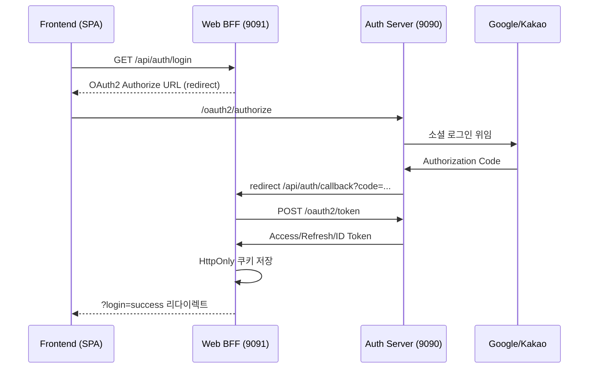
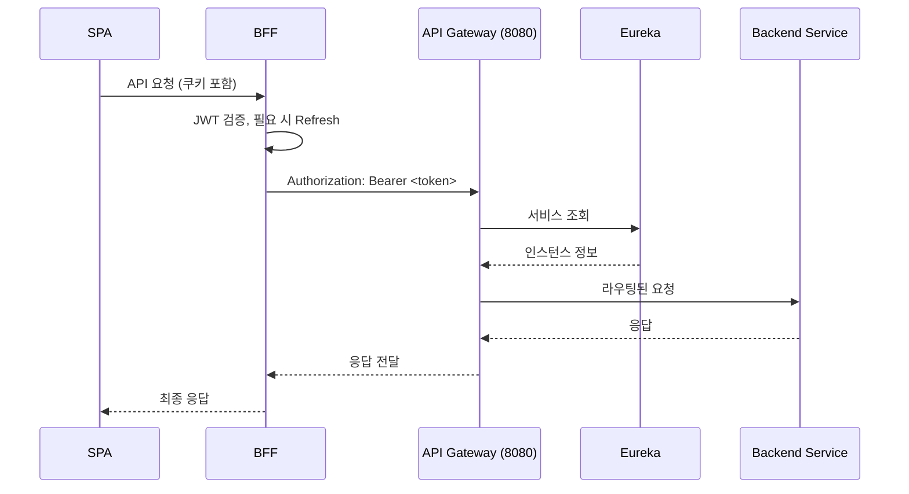

# Spring MSA Boilerplate

> Spring Boot 3.3 + Spring Cloud 2023 기반의 OAuth2/OIDC 인증 서버, BFF(Backend for Frontend), API Gateway, 서비스 디스커버리, 공통 인프라 라이브러리를 한 번에 제공하는 마이크로서비스 스타터 키트입니다.

## 프로젝트 한눈에
- OAuth2 Authorization Server(authServer)와 Web BFF(web-bff-server) 조합으로 SPA·모바일 프런트가 토큰을 직접 다루지 않고도 로그인/로그아웃을 수행
- Spring Cloud Gateway + Netflix Eureka로 서비스 라우팅·디스커버리를 구성하고 확장 가능한 백엔드 서비스 진입점을 제공
- Redis(세션/Authorization Store) + MySQL(사용자 저장소) + HttpOnly 쿠키 전략으로 토큰 탈취 위험을 줄인 인증 구조
- `commonLib`, `infra` 모듈을 통해 모든 서비스에서 동일한 상수/HTTP 상태/직렬화/암호화/웹 클라이언트 설정을 재사용
- Docker Compose, Gradle 멀티 모듈, Actuator, WebClient 등 운영에 필요한 기본 도구 포함
- Google/Kakao 소셜 로그인 + 자체 회원가입(Thymeleaf) + 토큰 블랙리스트/Refresh 자동화까지 기본 제공

## 전체 아키텍처
```
                ┌────────────────────┐
                │   Frontend (SPA)   │ 3000
                └──────────┬─────────┘
                           │ CORS + HttpOnly 쿠키
                           ▼
┌────────────────────┐ 9091 ┌────────────────────┐ 9090 ┌────────────────────┐
│  Web BFF Server    │◄────►│  Auth Server       │◄────►│ Google / Kakao     │
│  (OAuth2 Client    │      │  (OAuth2 + OIDC)   │      │ 외부 IdP           │
└──────────┬─────────┘      └──────────┬─────────┘      └────────────────────┘
           │ JWT Proxy                 │ Redis Authorization + MySQL User Store
           │                           ▼
           │                 ┌────────────────────┐ 6379
           │                 │       Redis        │
           │                 └────────────────────┘
           ▼
┌────────────────────┐ 8080 ┌────────────────────┐ 8761 ┌────────────────────┐
│  API Gateway       │◄────►│  Eureka Server     │      │ Backend Services    │ (TODO 확장)
│  (Spring Cloud G/W)│      │  (Discovery)       │─────►│ (주문/상품 등)      │
└────────────────────┘      └────────────────────┘      └────────────────────┘
```

## 서비스 & 포트 요약

| 모듈 | 설명 | 기본 포트 | 핵심 기술 |
| --- | --- | --- | --- |
| `authServer` | OAuth2 Authorization Server + 사용자 관리 | 9090 | Spring Authorization Server, Redis, JPA(MySQL), Thymeleaf |
| `web-bff-server` | SPA 전용 BFF (OAuth2 Client + Resource Server) | 9091 | Spring Security, WebClient, HttpOnly 쿠키, JWT 검증 |
| `apiGateway` | 외부 진입점 / 라우팅 | 8080 | Spring Cloud Gateway, Netty, Global CORS |
| `eurekaServer` | 서비스 디스커버리 | 8761 | Netflix Eureka |
| `commonLib` | 상수/에러코드/JWK 유틸 | - | Java Library, Nimbus JOSE |
| `infra` | Redis/WebClient/ObjectMapper/Encoder 등 공통 Bean | - | Java Library, @Enable* Import |

## 모듈 상세

### authServer (`authServer/`)
- `AuthorizationServerConfig`, `SecurityConfig`에서 Authorization Server + Form/OAuth2 로그인 필터 체인 분리, OIDC(Client Registration Endpoint) 활성화
- `AuthorizationRepositoryConfig`가 `RegisteredClient`(bff-client)와 토큰 TTL(Access 10분/Refresh 1일)을 설정
- `KeyConfig`는 `commonLib`의 `Jwk.generateRsa()`로 RSA 키쌍을 생성하고 ID Token claims(`id`, `loginId`, `role` 등)을 커스터마이즈
- `RedisOAuth2AuthorizationService` + `AuthRedisCustomizer` + `TokenBlacklistService`로 Authorization Code/Token/ID Token 상태를 Redis TTL 기반으로 관리하고 로그아웃 시 블랙리스트 처리
- `SignupController` + `login.html`/`signup.html`로 로컬 가입과 소셜 2차 가입을 지원하며 `SignupService`가 비밀번호 인코딩/Role 부여 처리
- `OAuth2LoginSuccessHandler`는 신규 소셜 사용자를 `/signup?social=true`로 리다이렉트, 기존 사용자는 저장된 Authorization Request로 복귀시킵니다.
- `AppProperties`에서 base URL/포트를 한 번에 관리하여 Redirect URI, Signup URL, Gateway Callback URL을 재사용

### web-bff-server (`web-bff-server/`)
- `AuthController`가 `/api/auth/login|callback|status|user/me|logout` REST 엔드포인트 제공, `CookieUtil`이 Access/Refresh 토큰을 HttpOnly + SameSite=Lax 쿠키로 저장
- `TokenService`는 WebClient로 `/oauth2/token` 교환, `/userinfo` 조회, Refresh Grant를 수행하고, `JwtAuthEntryPoint`는 만료 시 Refresh가 성공하면 `449 Retry With`를 내려 SPA 재시도를 유도
- `SecurityConfig`는 Resource Server 모드에서 Auth Server `/.well-known/jwks.json`을 사용하여 JWT를 검증하고, 필요 시 `JwtFromCookieFilter`를 활성화해 Authorization 헤더를 자동 주입 가능
- `AppProperties`는 Auth/BFF/Frontend URL 계산을 캡슐화해 리다이렉트 및 WebClient 호출의 오타를 방지

### apiGateway (`apiGateway/`)
- Spring Cloud Gateway로 `/api/auth/**` 라우팅 예제가 포함되어 있으며, `globalcors`에서 로컬 개발 도메인을 화이트리스트 처리
- `application.yml`에 `JWT_SECRET`, `INTERNAL_TOKEN`, `permit-all-paths` 등을 외부 환경 변수로 넘길 수 있도록 설계되어 추가 라우팅/보안 정책을 쉽게 확장 가능
- Eureka Client로 등록되어 Backend 서비스와 동적으로 연결

### eurekaServer (`eurekaServer/`)
- `EurekaServerApplication` 하나로 구성되며 `register-with-eureka: false` 설정으로 독립 실행, 8761 포트에서 대시보드를 제공

### commonLib (`commonLib/`)
- `ErrorCode`, `LoginResult`, `CustomHttpStatus`, `Jwk` 등 모든 서비스에서 사용되는 상수/HTTP 상태/키 유틸을 제공

### infra (`infra/`)
- `ObjectMapperConfig`(snake_case + JavaTime), `RedisConfig`(GenericJackson2JsonRedisSerializer), `WebClientConfig`, `ModelMapperConfig`, `PasswordEncoderConfig`를 Bean으로 정의
- `@EnableRedisConfig`, `@EnableWebConfig`, `@EnableObjMapperConfig`, `@EnableModelMapperConfig`, `@EnablePasswordEncoderConfig`로 필요한 모듈에서 명시적으로 활성화

## 인증 흐름

### 로그인


### 보호 API 호출


## 디렉터리 맵
```
spring-msa-boilerplate/
├── authServer/
│   ├── config/ (AuthorizationServerConfig, KeyConfig, AppProperties…)
│   ├── controller/ (LoginController, SignupController)
│   ├── handler/, redis/, service/, repository/, entity/, dto/
│   └── resources/templates/login|signup.html
├── web-bff-server/
│   ├── controller/AuthController.java
│   ├── service/TokenService.java
│   ├── security/(JwtAuthEntryPoint, JwtFromCookieFilter)
│   └── utils/CookieUtil.java
├── apiGateway/
│   └── src/main/resources/application.yml
├── eurekaServer/
├── commonLib/
├── infra/
├── docker-compose.yml (Redis)
├── build.gradle / settings.gradle
└── README.md
```

## 개발 환경 준비

### 필수 요구사항
- Java 17 이상
- Redis 7.x (또는 호환 버전) – `docker-compose up -d`
- MySQL 8.x (또는 호환 DB) – 사용자 정보 저장
- Gradle Wrapper, Git, cURL, Docker Desktop/Colima
- (선택) React/Vue 등 SPA 클라이언트 3000번 포트

### 환경 변수

| 변수 | 설명 | 사용 서비스 |
| --- | --- | --- |
| `GOOGLE_CLIENT_ID`, `GOOGLE_SECRET_ID` | Google OAuth 클라이언트 정보 | authServer |
| `KAKAO_REST_API_KEY`, `KAKAO_CLIENT_SECRET` | Kakao OAuth 클라이언트 정보 | authServer |
| `TEST_DB_URL`, `DB_USERNAME`, `DB_PASSWORD` | 사용자 DB 접속 정보 | authServer |
| `JWT_SECRET` | Gateway/백엔드에서 사용하는 대칭키 | apiGateway |
| `INTERNAL_TOKEN` | 내부 호출/예시 보안 토큰 | apiGateway |

Linux/macOS:
```bash
export GOOGLE_CLIENT_ID=your-google-client-id
export GOOGLE_SECRET_ID=your-google-secret
# ...
export INTERNAL_TOKEN=your-internal-token
```

Windows(cmd):
```cmd
set GOOGLE_CLIENT_ID=your-google-client-id
set GOOGLE_SECRET_ID=your-google-secret
:: ...
set INTERNAL_TOKEN=your-internal-token
```

## 실행 방법

1. **Redis 기동**
   ```bash
   docker-compose up -d
   ```
2. **전체 빌드**
   ```bash
   ./gradlew clean build
   ```
3. **서비스 순서**
   ```bash
   ./gradlew :eurekaServer:bootRun
   ./gradlew :authServer:bootRun
   ./gradlew :web-bff-server:bootRun
   ./gradlew :apiGateway:bootRun
   ```
   Windows는 `gradlew.bat` 사용. 포트는 각 `application.yml`에서 조정 가능.
4. **JAR 실행**
   ```bash
   java -jar eurekaServer/build/libs/eurekaServer-0.0.1-SNAPSHOT.jar
   # ...
   ```
5. **Health 확인**
    - `http://localhost:8761` (Eureka Dashboard)
    - `http://localhost:9090/actuator/health`
    - `http://localhost:8080/actuator/health`

## API & 유틸 엔드포인트

| 서비스 | 엔드포인트 |
| --- | --- |
| Web BFF 9091 | `GET /api/auth/login`, `GET /api/auth/callback`, `GET /api/auth/status`, `GET /api/auth/user/me`, `POST /api/auth/logout` |
| Auth Server 9090 | `GET /oauth2/authorize`, `POST /oauth2/token`, `POST /oauth2/revoke`, `GET /userinfo`, `GET /.well-known/jwks.json`, `GET /login`, `GET/POST /signup` |
| API Gateway 8080 | `GET /api/auth/**` (예시 라우팅), 추가 라우트는 `application.yml` 수정 |
| Eureka 8761 | `GET /` (대시보드) |
| Actuator | 각 서비스 `/actuator/**` (필요 시 yml에서 노출) |

## 공통 인프라 & 보안 포인트
- **RedisOAuth2AuthorizationService**: Authorization Code/Access/Refresh/ID Token을 Redis TTL + 인덱스로 저장하여 수평 확장 대비
- **TokenBlacklistService**: 로그아웃 시 Access Token을 남은 TTL 동안 블랙리스트로 유지
- **JwtAuthEntryPoint**: JWT 만료 → Refresh 성공 시 `449 Retry With` 응답으로 프런트 재시도를 유도
- **CookieUtil**: HttpOnly + SameSite + Secure 플래그를 일원화, 프로덕션에서는 `secure=true`, `SameSite=None` 권장
- **CorsConfig / SecurityConfig**: 프런트/브라우저 리다이렉트 시 필요한 오리진만 허용
- **AppProperties**: Redirect URI, Signup URL 등 모든 경로 계산을 중앙화
- **Infra 애노테이션**: `@EnableRedisConfig` 등으로 공통 Bean을 명시적으로 포함해 클래스패스 의존을 줄임
- **CustomRequestCache**: OAuth Authorization 요청 외 정적 요청(DevTools 등)을 저장하지 않도록 필터링

## 테스트 & 검증

```bash
./gradlew test

curl -i http://localhost:9091/api/auth/status

curl -i --cookie "ACCESS_TOKEN=<token>" http://localhost:9091/api/auth/user/me
```

- 소셜 로그인 후 `/signup?social=true` 화면에서 추가 정보 입력 시 MySQL `users` 테이블에 레코드가 생성되는지 확인
- Redis CLI에서 `keys oauth2:*`로 Authorization/Token/Blacklist 키를 확인 가능

## 배포 & 운영 팁
- 프로덕션에서는 HTTPS 적용 + `CookieUtil` `secure=true`, `SameSite=None` 설정 필수
- Redis는 AOF/Sentinel/Cluster 구성 권장 (`docker-compose`는 단일 노드)
- Auth Server RSA 키를 외부 KMS/키스토어에서 주입하려면 `KeyConfig`를 확장하면 됨
- API Gateway에 RateLimit, CircuitBreaker, Auth 헤더 주입 필터 등을 추가해보세요
- `infra` 모듈을 별도 패키지로 추출해 다른 프로젝트에서도 재사용 가능

## 향후 확장 아이디어
- Config Server / 중앙 환경 설정
- Backend 서비스 예제(주문/상품) + Gateway 라우팅 코드
- 다중 OAuth2 클라이언트, PKCE, Device Flow 등 추가 플로우
- Web BFF에서 SSE/WebSocket/GraphQL 프록시 패턴 실험
- Observability (Prometheus, Zipkin, Grafana) 연동

## 기여하기
1. Fork
2. `git checkout -b feature/my-feature`
3. `./gradlew test`
4. `git commit -m "Add my feature"`
5. PR 생성

## 라이선스
MIT License – `LICENSE` 참고.

## 문의
이슈 트래커에서 버그/질문/제안사항을 남겨주세요.
 