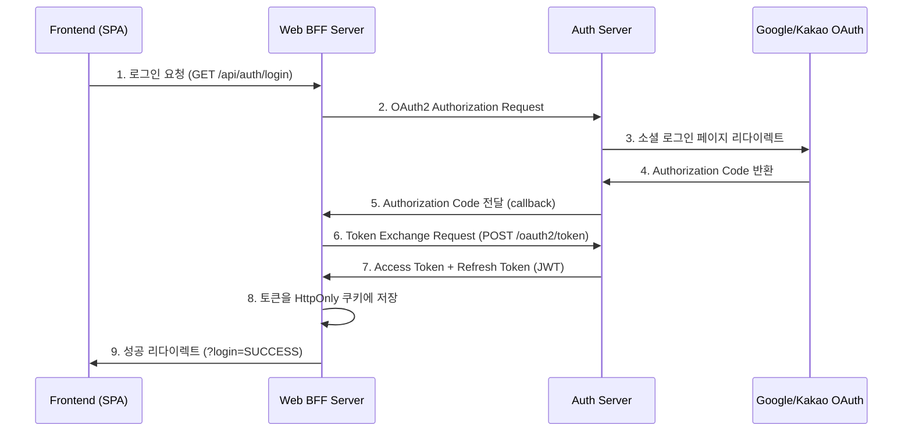
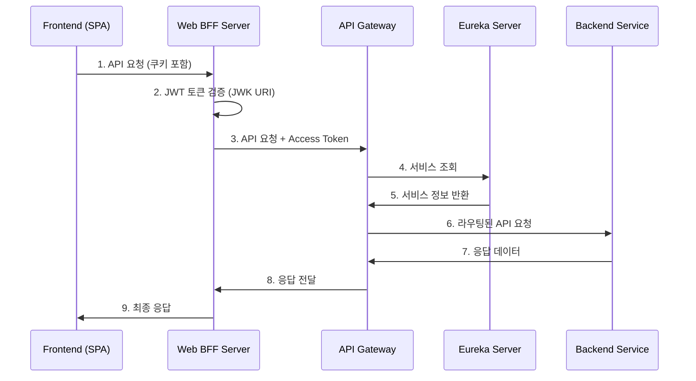

# Spring MSA Boilerplate

Spring Boot 기반의 마이크로서비스 아키텍처 보일러플레이트 프로젝트입니다. OAuth2 인증 서버와 BFF(Backend for Frontend) 패턴을 중심으로 구성되어 있습니다.

## 🏗️ 아키텍처 개요

```
┌─────────────────┐    ┌─────────────────┐    ┌─────────────────┐
│   Frontend      │    │  Web BFF Server │    │   Auth Server   │
│   (React/Vue)   │◄──►│   (Port: 9091)  │◄──►│   (Port: 9090)  │
│   Port: 3000    │    │   OAuth2 Client │    │  OAuth2 AuthZ   │
└─────────────────┘    └────────┬────────┘    └─────────┬───────┘
                                │                       │
                                │                       │ (OAuth2 Authorization 상태 저장)
                                │                       ▼
                                │                ┌──────────────┐
                                │                │   Redis      │
                                │                │   Port: 6379 │
                                │                └──────────────┘
                                │
                                │ (API 요청 프록시)
                                ▼
                       ┌─────────────────┐
                       │   API Gateway   │◄──────┐
                       │   Port: 8080    │       │ (서비스 디스커버리)
                       └────────┬────────┘       │
                                │                │
                                │ (라우팅)        │
                                ▼                │
                       ┌─────────────────┐       │
                       │ Backend Services│       │
                       │  (향후 구현 예정) │       │
                       └─────────────────┘       │
                                                 │
                                       ┌─────────┴───────┐
                                       │   Eureka Server │
                                       │   Port: 8761    │
                                       └─────────────────┘
```

## 📦 모듈 구성

### 1. **authServer** (OAuth2 Authorization Server) - 포트 9090
- **역할**: OAuth2 표준을 준수하는 인증 서버
- **주요 기능**:
  - Google, Kakao 소셜 로그인 지원
  - JWT 토큰 발급 및 검증
  - OAuth2 Authorization Code Flow 구현
  - OIDC (OpenID Connect) 지원
  - 사용자 인증 및 권한 관리
  - Redis를 이용한 Authorization 상태 관리
  - MySQL 데이터베이스 연동 (사용자 정보 저장)

### 2. **web-bff-server** (BFF 서버) - 포트 9091
- **역할**: Frontend와 Backend 사이의 중간 계층 (Backend for Frontend)
- **주요 기능**:
  - OAuth2 클라이언트 역할
  - HttpOnly 쿠키 기반 토큰 관리
  - JWT 토큰 검증 (Resource Server)
  - 인증 상태 및 사용자 정보 제공
  - CORS 설정 및 보안 강화
  - 토큰 자동 갱신 지원

### 3. **apiGateway** (API Gateway) - 포트 8080
- **역할**: 마이크로서비스 진입점
- **주요 기능**:
  - 서비스 라우팅 및 로드 밸런싱
  - Eureka 서비스 디스커버리 연동
  - CORS 설정
  - Spring Cloud Gateway 기반

### 4. **eurekaServer** (Service Discovery) - 포트 8761
- **역할**: 마이크로서비스 등록 및 발견
- **주요 기능**:
  - 서비스 인스턴스 등록
  - 서비스 상태 모니터링
  - 로드 밸런싱 지원
  - Eureka 대시보드 제공

### 5. **commonLib** (공통 라이브러리)
- **역할**: 공통 상수 및 유틸리티
- **주요 기능**:
  - 에러 코드 정의
  - 로그인 결과 상수
  - HTTP 상태 코드 커스텀
  - JWT JWK 유틸리티

### 6. **infra** (인프라 라이브러리)
- **역할**: 공통 인프라 설정 및 유틸리티
- **주요 기능**:
  - Redis 설정 (EnableRedisConfig)
  - WebClient 설정 (EnableWebConfig)
  - ObjectMapper 설정 (EnableObjMapperConfig)
  - ModelMapper 설정 (EnableModelMapperConfig)
  - PasswordEncoder 설정 (EnablePasswordEncoderConfig)
  - 재사용 가능한 인프라 구성 요소

## 🚀 기술 스택

### Backend
- **Spring Boot 3.3.5**
- **Spring Cloud 2023.0.3**
- **Spring Security OAuth2**
  - OAuth2 Authorization Server
  - OAuth2 Client
  - OAuth2 Resource Server
- **Spring Cloud Gateway** (API Gateway)
- **Spring Cloud Netflix Eureka** (Service Discovery)
- **Redis** (Authorization 상태 저장 및 세션 관리)
- **MySQL** (사용자 데이터)
- **JWT** (토큰 기반 인증)
- **Thymeleaf** (로그인 페이지 템플릿)

### Frontend 지원
- **CORS** 설정으로 React/Vue 등 SPA 지원
- **HttpOnly 쿠키** 기반 세션 관리
- **JWT 토큰** 자동 검증

## 🔐 인증 플로우

### 1. 로그인 플로우


### 2. API 호출 플로우


## 🛠️ 설치 및 실행

### 1. 사전 요구사항
- Java 17+
- Redis
- MySQL (선택사항, 사용자 데이터 저장용)

### 2. 환경 변수 설정

각 서비스 실행 전에 다음 환경 변수를 설정해야 합니다:

```bash
# Auth Server 환경 변수
export GOOGLE_CLIENT_ID="your-google-client-id"
export GOOGLE_SECRET_ID="your-google-secret"
export KAKAO_REST_API_KEY="your-kakao-api-key"
export KAKAO_CLIENT_SECRET="your-kakao-secret"
export TEST_DB_URL="jdbc:mysql://localhost:3306/testdb"
export DB_USERNAME="your-db-username"
export DB_PASSWORD="your-db-password"

# API Gateway 환경 변수
export JWT_SECRET="your-jwt-secret"
export INTERNAL_TOKEN="your-internal-token"
```

Windows 환경에서는:
```cmd
set GOOGLE_CLIENT_ID=your-google-client-id
set GOOGLE_SECRET_ID=your-google-secret
set KAKAO_REST_API_KEY=your-kakao-api-key
set KAKAO_CLIENT_SECRET=your-kakao-secret
set TEST_DB_URL=jdbc:mysql://localhost:3306/testdb
set DB_USERNAME=your-db-username
set DB_PASSWORD=your-db-password
set JWT_SECRET=your-jwt-secret
set INTERNAL_TOKEN=your-internal-token
```

### 3. Redis 실행
```bash
# Docker로 Redis 실행
docker-compose up -d redis

# 또는 직접 실행
redis-server
```

### 4. 서비스 실행 순서

**Gradle Multi-Project 빌드:**

```bash
# 루트에서 모든 프로젝트 빌드
./gradlew build

# 각 서비스 실행 (새 터미널에서)
# 1. Eureka Server 시작
cd eurekaServer
./gradlew bootRun

# 2. Auth Server 시작 (새 터미널)
cd authServer
./gradlew bootRun

# 3. Web BFF Server 시작 (새 터미널)
cd web-bff-server
./gradlew bootRun

# 4. API Gateway 시작 (새 터미널)
cd apiGateway
./gradlew bootRun
```

**Windows 환경:**
```cmd
gradlew.bat build

cd eurekaServer
gradlew.bat bootRun

cd ..\authServer
gradlew.bat bootRun

cd ..\web-bff-server
gradlew.bat bootRun

cd ..\apiGateway
gradlew.bat bootRun
```

## 📋 API 엔드포인트

### Web BFF Server (BFF) - 포트 9091
```
GET  /api/auth/login          # 로그인 시작 (OAuth2 인증 서버로 리다이렉트)
GET  /api/auth/callback       # OAuth2 콜백 (Authorization Code 수신)
GET  /api/auth/status         # 로그인 상태 확인
GET  /api/auth/user/me        # 사용자 정보 조회
POST /api/auth/logout         # 로그아웃 (토큰 폐기)
```

### Auth Server (OAuth2 Authorization Server) - 포트 9090
```
GET  /oauth2/authorize        # OAuth2 인증 요청
POST /oauth2/token            # 토큰 발급 (Authorization Code 교환)
POST /oauth2/revoke           # 토큰 폐기 (RFC 7009)
GET  /userinfo                # 사용자 정보 (OIDC)
GET  /login                   # 로그인 페이지 (Thymeleaf)
GET  /.well-known/jwks.json   # JWT 공개키 (JWK Set)
```

### API Gateway - 포트 8080
```
GET  /api/auth/**             # 인증 관련 라우팅 (authServer로 전달)
```

### Eureka Server - 포트 8761
```
GET  /                        # Eureka 대시보드
```

## 🔧 설정 파일

### Web BFF Server 설정 (application.yml)
```yaml
spring:
  application:
    name: web-bff-server
  web:
    cors:
      allowed-origins: "http://localhost:3000"
      allowed-methods: "GET,POST,PUT,DELETE,OPTIONS"
      allowed-headers: "*"
      allow-credentials: true
  security:
    oauth2:
      client:
        registration:
          auth-server:
            client-id: bff-client
            client-secret: bff-secret
            authorization-grant-type: authorization_code
            redirect-uri: http://localhost:9091/api/auth/callback
            scope: openid,profile,email
        provider:
          auth-server:
            authorization-uri: http://localhost:9090/oauth2/authorize
            token-uri: http://localhost:9090/oauth2/token
            user-info-uri: http://localhost:9090/userinfo
            jwk-set-uri: http://localhost:9090/.well-known/jwks.json

server:
  port: 9091

app:
  base-url: http://localhost
  ports:
    auth-server: 9090
    frontend: 3000
    auth-gateway: 9091
```

### Auth Server 설정 (application.yml)
```yaml
spring:
  application:
    name: auth-server
  data:
    redis:
      host: localhost
      port: 6379
  security:
    oauth2:
      authorization-server:
        issuer: http://localhost:9090
      client:
        registration:
          google:
            client-id: ${GOOGLE_CLIENT_ID}
            client-secret: ${GOOGLE_SECRET_ID}
            redirect-uri: "{baseUrl}/login/oauth2/code/{registrationId}"
            authorization-grant-type: authorization_code
            scope: openid,email,profile
          kakao:
            client-id: ${KAKAO_REST_API_KEY}
            client-secret: ${KAKAO_CLIENT_SECRET}
            redirect-uri: "{baseUrl}/login/oauth2/code/{registrationId}"
            authorization-grant-type: authorization_code
            client-authentication-method: client_secret_post
            scope: profile_nickname,profile_image

server:
  port: 9090

app:
  base-url: http://localhost
  ports:
    auth-server: 9090
    frontend: 3000
    auth-gateway: 9091
```

### API Gateway 설정 (application.yml)
```yaml
spring:
  application:
    name: apiGateway
  cloud:
    gateway:
      routes:
        - id: authServer
          uri: lb://authService
          predicates:
            - Path=/api/auth/**
          filters:
            - StripPrefix=0

server:
  port: 8080

eureka:
  client:
    serviceUrl:
      defaultZone: "http://localhost:8761/eureka/"
```

## 🧪 테스트

### 1. 로그인 테스트
```bash
# 브라우저에서 접속
http://localhost:9091/api/auth/login
```

### 2. API 테스트
```bash
# 상태 확인
curl -X GET http://localhost:9091/api/auth/status

# 사용자 정보 조회 (쿠키 필요)
curl -X GET http://localhost:9091/api/auth/user/me \
  --cookie "ACCESS_TOKEN=your-access-token"

# 로그아웃
curl -X POST http://localhost:9091/api/auth/logout \
  --cookie "REFRESH_TOKEN=your-refresh-token"
```

### 3. Eureka 대시보드 확인
```
http://localhost:8761
```

## 🔒 보안 특징

### 1. 토큰 관리
- **Access Token**: JWT 형식, Auth Server에서 발급
- **Refresh Token**: 토큰 갱신용
- **HttpOnly 쿠키**: XSS 공격 방지
- **자동 갱신**: Access Token 만료 시 자동 갱신 (구현 예정)

### 2. 세션 보안
- **HttpOnly 쿠키**: JavaScript 접근 불가
- **쿠키 기반 인증**: SPA에서 토큰 직접 관리 불필요
- **CORS 설정**: 허용된 도메인만 접근 가능
- **JWT 검증**: Resource Server를 통한 토큰 검증

### 3. OAuth2 표준 준수
- **Authorization Code Flow**: 가장 안전한 OAuth2 플로우
- **OIDC 지원**: 사용자 인증 및 식별
- **JWT 토큰**: 무상태 인증 지원
- **JWK Set**: 공개키 기반 토큰 검증

## 📁 프로젝트 구조

```
spring-msa-boilerplate/
├── authServer/              # OAuth2 Authorization Server
│   ├── src/main/java/com/example/authserver/
│   │   ├── config/         # 보안 및 OAuth2 설정
│   │   ├── controller/     # 로그인 컨트롤러
│   │   ├── handler/        # 인증 성공 핸들러
│   │   ├── service/        # OIDC 사용자 서비스
│   │   ├── dto/           # 데이터 전송 객체
│   │   └── entity/        # 엔티티
│   └── src/main/resources/
│       ├── application.yml # 서버 설정
│       └── templates/      # 로그인 페이지 (Thymeleaf)
├── web-bff-server/         # BFF 서버
│   ├── src/main/java/com/example/webbffserver/
│   │   ├── config/         # 보안 설정
│   │   ├── controller/     # 인증 컨트롤러
│   │   ├── service/        # 토큰 관리 서비스
│   │   ├── security/       # JWT 필터 및 인증 처리
│   │   ├── dto/           # 응답 DTO
│   │   └── utils/         # 유틸리티
│   └── src/main/resources/
│       └── application.yml # BFF 설정
├── apiGateway/             # API Gateway
│   ├── src/main/java/com/example/apigateway/
│   └── src/main/resources/
│       └── application.yml # Gateway 설정
├── eurekaServer/           # Service Discovery
│   ├── src/main/java/com/example/eurekaserver/
│   └── src/main/resources/
│       └── application.yml # Eureka 설정
├── commonLib/              # 공통 라이브러리
│   └── src/main/java/com/example/
│       ├── constants/      # 에러 코드, 상수
│       ├── http/          # HTTP 유틸리티
│       └── util/          # 공통 유틸리티
├── infra/                  # 인프라 라이브러리
│   └── src/main/java/com/example/infra/
│       ├── annotation/     # 활성화 애노테이션
│       └── config/        # 인프라 설정 (Redis, WebClient 등)
├── docker-compose.yml      # Redis 컨테이너
├── build.gradle           # 루트 빌드 설정
├── settings.gradle        # 모듈 설정
└── README.md              # 프로젝트 문서
```

## 🚀 배포

### Docker 배포
```bash
# Redis 실행
docker-compose up -d

# 각 서비스 빌드
./gradlew build

# JAR 파일 실행
java -jar eurekaServer/build/libs/eurekaServer-0.0.1-SNAPSHOT.jar
java -jar authServer/build/libs/authServer-0.0.1-SNAPSHOT.jar
java -jar web-bff-server/build/libs/web-bff-server-0.0.1-SNAPSHOT.jar
java -jar apiGateway/build/libs/apiGateway-0.0.1-SNAPSHOT.jar
```

### 프로덕션 환경 설정
- 환경 변수를 운영 환경에 맞게 설정
- HTTPS 적용 (쿠키 Secure 플래그)
- 데이터베이스 연결 풀 최적화
- Redis 클러스터 구성 (고가용성)
- 로그 레벨 조정

## 🤝 기여하기

1. Fork the Project
2. Create your Feature Branch (`git checkout -b feature/AmazingFeature`)
3. Commit your Changes (`git commit -m 'Add some AmazingFeature'`)
4. Push to the Branch (`git push origin feature/AmazingFeature`)
5. Open a Pull Request

## 📄 라이선스

이 프로젝트는 MIT 라이선스 하에 배포됩니다. 자세한 내용은 `LICENSE` 파일을 참조하세요.

## 📞 문의

프로젝트에 대한 문의사항이 있으시면 이슈를 생성해 주세요.

---

**주요 특징**:
- ✅ OAuth2 표준 준수
- ✅ OIDC (OpenID Connect) 지원
- ✅ BFF 패턴 구현
- ✅ JWT 토큰 기반 인증
- ✅ HttpOnly 쿠키 기반 보안
- ✅ 소셜 로그인 지원 (Google, Kakao)
- ✅ 마이크로서비스 아키텍처
- ✅ 서비스 디스커버리 (Eureka)
- ✅ API Gateway 패턴
- ✅ Redis 기반 상태 관리
- ✅ 모듈화된 공통 라이브러리 (commonLib, infra)
