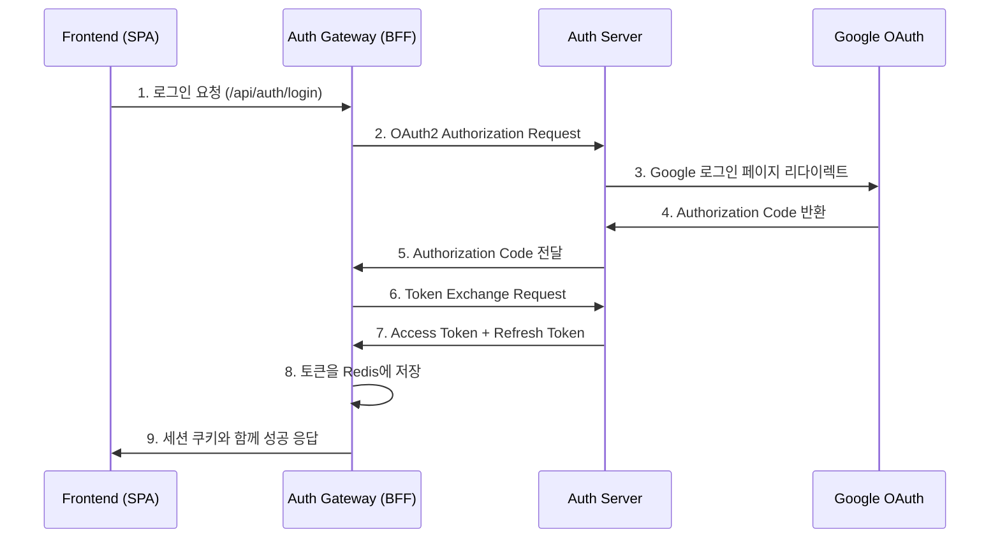
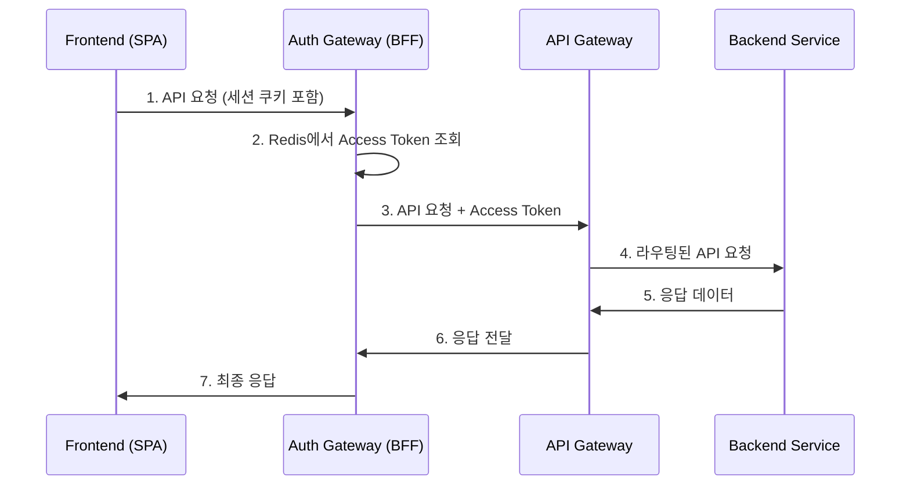

# Spring MSA Boilerplate

Spring Boot 기반의 마이크로서비스 아키텍처 보일러플레이트 프로젝트입니다. OAuth2 인증 서버와 BFF(Backend for Frontend) 패턴을 중심으로 구성되어 있습니다.

## 🏗️ 아키텍처 개요

```
┌─────────────────┐    ┌─────────────────┐    ┌─────────────────┐
│   Frontend      │    │   Auth Gateway  │    │   Auth Server   │
│   (React/Vue)   │◄──►│   (BFF)         │◄──►│   (OAuth2)      │
│   Port: 3000    │    │   Port: 9091    │    │   Port: 9090    │
└─────────────────┘    └─────────────────┘    └─────────────────┘
                                │                       │
                                │                       │
                       ┌─────────────────┐    ┌─────────────────┐
                       │   API Gateway   │    │   Eureka Server │
                       │   Port: 8080    │    │   Port: 8761    │
                       └─────────────────┘    └─────────────────┘
                                │
                                │
                       ┌─────────────────┐
                       │   Redis         │
                       │   Port: 6379    │
                       └─────────────────┘
```

## 📦 모듈 구성

### 1. **authServer** (OAuth2 Authorization Server) - 포트 9090
- **역할**: OAuth2 표준을 준수하는 인증 서버
- **주요 기능**:
  - Google, Kakao 소셜 로그인 지원
  - JWT 토큰 발급 및 검증
  - OAuth2 Authorization Code Flow 구현
  - 사용자 인증 및 권한 관리

### 2. **authGateway** (BFF 서버) - 포트 9091
- **역할**: Frontend와 Backend 사이의 중간 계층
- **주요 기능**:
  - OAuth2 클라이언트 역할
  - 세션 기반 토큰 관리 (Redis)
  - API 프록시 및 라우팅
  - 보안 강화 (HttpOnly 쿠키, CORS)

### 3. **apiGateway** (API Gateway) - 포트 8080
- **역할**: 마이크로서비스 진입점
- **주요 기능**:
  - 서비스 라우팅 및 로드 밸런싱
  - CORS 설정
  - Eureka 서비스 디스커버리 연동

### 4. **eurekaServer** (Service Discovery) - 포트 8761
- **역할**: 마이크로서비스 등록 및 발견
- **주요 기능**:
  - 서비스 인스턴스 등록
  - 서비스 상태 모니터링
  - 로드 밸런싱 지원

### 5. **commonLib** (공통 라이브러리)
- **역할**: 공통 유틸리티 및 설정
- **주요 기능**:
  - JWT 키 생성 (RSA)
  - 공통 DTO 및 유틸리티

## 🚀 기술 스택

### Backend
- **Spring Boot 3.3.5**
- **Spring Security OAuth2**
- **Spring Cloud Gateway**
- **Spring Cloud Netflix Eureka**
- **Redis** (세션 저장소)
- **MySQL** (사용자 데이터)
- **JWT** (토큰 기반 인증)

### Frontend 지원
- **CORS** 설정으로 React/Vue 등 SPA 지원
- **HttpOnly 쿠키** 기반 세션 관리

## 🔐 인증 플로우

### 1. 로그인 플로우


### 2. API 호출 플로우


## 🛠️ 설치 및 실행

### 1. 사전 요구사항
- Java 17+
- Redis
- MySQL (선택사항)

### 2. 환경 변수 설정
```bash
# Auth Server 환경 변수
export GOOGLE_CLIENT_ID="your-google-client-id"
export GOOGLE_SECRET_ID="your-google-secret"
export KAKAO_REST_API_KEY="your-kakao-api-key"
export KAKAO_CLIENT_SECRET="your-kakao-secret"
export TEST_DB_URL="jdbc:mysql://localhost:3306/testdb"
export DB_USERNAME="your-db-username"
export DB_PASSWORD="your-db-password"
export JWT_SECRET="your-jwt-secret"
export INTERNAL_TOKEN="your-internal-token"
```

### 3. Redis 실행
```bash
# Docker로 Redis 실행
docker-compose up -d redis

# 또는 직접 실행
redis-server
```

### 4. 서비스 실행 순서
```bash
# 1. Eureka Server 시작
cd eurekaServer
./gradlew bootRun

# 2. Auth Server 시작 (새 터미널)
cd authServer
./gradlew bootRun

# 3. Auth Gateway 시작 (새 터미널)
cd authGateway
./gradlew bootRun

# 4. API Gateway 시작 (새 터미널)
cd apiGateway
./gradlew bootRun
```

## 📋 API 엔드포인트

### Auth Gateway (BFF) - 포트 9091
```
GET  /api/auth/login          # 로그인 시작
GET  /api/auth/callback       # OAuth2 콜백
GET  /api/auth/status         # 로그인 상태 확인
GET  /api/auth/user/me        # 사용자 정보 조회
POST /api/auth/logout         # 로그아웃
GET  /api/proxy/**            # API 프록시 (GET)
POST /api/proxy/**            # API 프록시 (POST)
PUT  /api/proxy/**            # API 프록시 (PUT)
DELETE /api/proxy/**          # API 프록시 (DELETE)
```

### Auth Server (OAuth2) - 포트 9090
```
GET  /oauth2/authorize        # OAuth2 인증 요청
POST /oauth2/token            # 토큰 발급
GET  /userinfo                # 사용자 정보
GET  /login                   # 로그인 페이지
GET  /.well-known/jwks.json   # JWT 공개키
```

### API Gateway - 포트 8080
```
GET  /api/auth/**             # 인증 관련 라우팅
```

### Eureka Server - 포트 8761
```
GET  /                        # Eureka 대시보드
```

## 🔧 설정 파일

### Auth Gateway 설정 (application.yml)
```yaml
server:
  port: 9091

spring:
  application:
    name: authGateway
  data:
    redis:
      host: localhost
      port: 6379
  security:
    oauth2:
      client:
        registration:
          auth-server:
            client-id: bff-client
            client-secret: bff-secret
            authorization-grant-type: authorization_code
            redirect-uri: http://localhost:9091/api/auth/callback
            scope: openid,profile,email
```

### Auth Server 설정 (application.yml)
```yaml
server:
  port: 9090

spring:
  application:
    name: auth-server
  security:
    oauth2:
      authorization-server:
        issuer: http://localhost:9090
      client:
        registration:
          google:
            client-id: ${GOOGLE_CLIENT_ID}
            client-secret: ${GOOGLE_SECRET_ID}
            redirect-uri: "{baseUrl}/login/oauth2/code/{registrationId}"
            authorization-grant-type: authorization_code
            scope: openid,email,profile
```

## 🧪 테스트

### 1. 로그인 테스트
```bash
# 브라우저에서 접속
http://localhost:9091/api/auth/login
```

### 2. API 테스트
```bash
# 상태 확인
curl -X GET http://localhost:9091/api/auth/status

# 사용자 정보 조회
curl -X GET http://localhost:9091/api/auth/user/me
```

### 3. HTTP 테스트 파일
각 모듈의 `test.http` 파일을 사용하여 API를 테스트할 수 있습니다.

## 🔒 보안 특징

### 1. 토큰 관리
- **Access Token**: 30분 유효 (Redis 저장)
- **Refresh Token**: 7일 유효 (Redis 저장)
- **자동 갱신**: Access Token 만료 시 자동 갱신

### 2. 세션 보안
- **HttpOnly 쿠키**: XSS 공격 방지
- **세션 기반**: SPA에서 토큰 직접 관리 불필요
- **CORS 설정**: 허용된 도메인만 접근 가능

### 3. OAuth2 표준 준수
- **Authorization Code Flow**: 가장 안전한 OAuth2 플로우
- **PKCE**: 공개 클라이언트 보안 강화
- **JWT 토큰**: 무상태 인증 지원

## 📁 프로젝트 구조

```
spring-msa-boilerplate/
├── authServer/              # OAuth2 Authorization Server
│   ├── src/main/java/com/example/authserver/
│   │   ├── config/         # 보안 설정
│   │   ├── controller/     # 로그인 컨트롤러
│   │   ├── handler/        # 인증 성공 핸들러
│   │   ├── service/        # OIDC 사용자 서비스
│   │   └── dto/           # 데이터 전송 객체
│   └── src/main/resources/
│       ├── application.yml # 서버 설정
│       └── templates/      # 로그인 페이지
├── authGateway/            # BFF 서버
│   ├── src/main/java/com/example/authgateway/
│   │   ├── config/         # 보안 및 Redis 설정
│   │   ├── controller/     # 인증 및 프록시 컨트롤러
│   │   ├── service/        # 토큰 관리 서비스
│   │   └── dto/           # 응답 DTO
│   └── src/main/resources/
│       └── application.yml # BFF 설정
├── apiGateway/             # API Gateway
├── eurekaServer/           # Service Discovery
├── commonLib/              # 공통 라이브러리
├── docker-compose.yml      # Redis 컨테이너
└── build.gradle           # 루트 빌드 설정
```

## 🚀 배포

### Docker 배포
```bash
# Redis 실행
docker-compose up -d

# 각 서비스 빌드 및 실행
./gradlew build
java -jar authServer/build/libs/authServer-0.0.1-SNAPSHOT.jar
java -jar authGateway/build/libs/authGateway-0.0.1-SNAPSHOT.jar
java -jar apiGateway/build/libs/apiGateway-0.0.1-SNAPSHOT.jar
java -jar eurekaServer/build/libs/eurekaServer-0.0.1-SNAPSHOT.jar
```

## 🤝 기여하기

1. Fork the Project
2. Create your Feature Branch (`git checkout -b feature/AmazingFeature`)
3. Commit your Changes (`git commit -m 'Add some AmazingFeature'`)
4. Push to the Branch (`git push origin feature/AmazingFeature`)
5. Open a Pull Request

## 📄 라이선스

이 프로젝트는 MIT 라이선스 하에 배포됩니다. 자세한 내용은 `LICENSE` 파일을 참조하세요.

## 📞 문의

프로젝트에 대한 문의사항이 있으시면 이슈를 생성해 주세요.

---

**주요 특징**:
- ✅ OAuth2 표준 준수
- ✅ BFF 패턴 구현
- ✅ JWT 토큰 기반 인증
- ✅ Redis 세션 관리
- ✅ 소셜 로그인 지원 (Google, Kakao)
- ✅ 마이크로서비스 아키텍처
- ✅ 서비스 디스커버리 (Eureka)
- ✅ API Gateway 패턴
